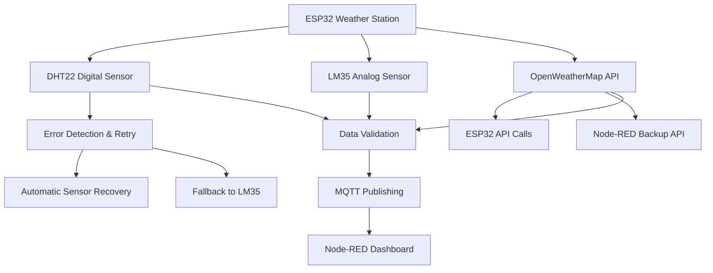

# 🌡️ ESP32 Weather Monitoring System

<div align="center">


*A comprehensive IoT weather monitoring system with real-time data visualization and WhatsApp alerts*

[🚀 Quick Start](#-quick-start) • [📋 Features](#-features) • [🔧 Installation](#-installation) • [🔌 Hardware](#-hardware-setup) • [📊 Usage](#-usage) • [🔍 MQTT Testing](#-mqtt-testing) • [📺 Video Tutorials](#-video-tutorials)

</div>

---

## 📺 Video Tutorials

**Complete YouTube Tutorial Series**: [ESP32 Weather Monitor Playlist](https://youtube.com/playlist?list=PLxxx-esp32-weather-monitor)

### 🎥 **Essential Videos**

| Tutorial | Duration | Difficulty | Description |
|----------|----------|------------|-------------|
| 🚀 [**Quick Start Guide**](https://youtube.com/watch?v=quick-start-guide) | 15 min | Beginner | Complete system overview and 20-minute setup |
| 🔧 [**Hardware Assembly**](https://youtube.com/watch?v=hardware-assembly) | 25 min | Beginner | Step-by-step wiring and component connections |
| 💻 [**Software Setup**](https://youtube.com/watch?v=software-setup) | 20 min | Intermediate | Arduino IDE, Node-RED installation and configuration |
| 📊 [**Dashboard Configuration**](https://youtube.com/watch?v=dashboard-config) | 18 min | Intermediate | Node-RED flow setup and customization |
| 📱 [**WhatsApp Integration**](https://youtube.com/watch?v=whatsapp-setup) | 12 min | Advanced | Complete WhatsApp notification setup |
| 🐛 [**Troubleshooting Guide**](https://youtube.com/watch?v=troubleshooting) | 30 min | All Levels | Common issues and solutions |

### 📚 **Advanced Topics**

| Tutorial | Focus Area | Description |
|----------|------------|-------------|
| 🌐 [**MQTT Deep Dive**](https://youtube.com/watch?v=mqtt-deep-dive) | Networking | Advanced MQTT configuration and debugging |
| 🔬 [**Sensor Calibration**](https://youtube.com/watch?v=sensor-calibration) | Hardware | Precision calibration and error handling |
| 🏠 [**Home Assistant Integration**](https://youtube.com/watch?v=homeassistant-integration) | Smart Home | Complete smart home automation setup |
| 📈 [**Data Analytics**](https://youtube.com/watch?v=data-analytics) | Analysis | Advanced data logging and trend analysis |

### 🔴 **Live Streams & Updates**
- **Weekly Q&A Sessions**: Fridays at 7 PM EST
- **New Feature Demos**: When updates are released  
- **Community Build Sessions**: Monthly collaborative builds
- **Troubleshooting Help**: Live assistance for common issues

**Subscribe & Bell Notification**: [ESP32 Weather Monitor Channel](https://youtube.com/@esp32weathermonitor) for latest videos and live streams!

---

## 🚀 Quick Start

**Get running in 20 minutes:**

1. **Hardware**: Connect DHT22 (GPIO 18), LM35 (GPIO 33), LCD (I2C), Fan (GPIO 15), Buzzer (GPIO 12)
2. **Software**: Install Arduino IDE v2.3.4 + ESP32 v2.0.14 + Required libraries
3. **Code**: Upload Arduino sketch with your WiFi credentials
4. **Dashboard**: Install Node-RED + Import flow + Deploy
5. **Test**: View dashboard at `http://localhost:1880/ui`

📺 **Video Tutorial**: [Complete Setup Guide](https://youtube.com/watch?v=setup-guide) | [Hardware Assembly](https://youtube.com/watch?v=hardware-assembly) | [Software Configuration](https://youtube.com/watch?v=software-config)

<details>
<summary>📌 <strong>One-Click Setup Commands</strong></summary>

```bash
# Install Node-RED and packages
npm install -g --unsafe-perm node-red@4.0.9
npm install -g node-red-dashboard node-red-contrib-ui-worldmap

# Start Node-RED
node-red
# Then visit http://localhost:1880 to import the flow
```

</details>

---

## 📋 Table of Contents

- [🌟 Features](#-features)
- [🔧 Hardware Requirements](#-hardware-requirements)
- [💻 Software Requirements](#-software-requirements)
- [🚀 Installation](#-installation)
- [🔌 Hardware Setup](#-hardware-setup)
- [⚙️ Configuration](#️-configuration)
- [📊 Usage](#-usage)
- [🔍 MQTT Testing](#-mqtt-testing)
- [📱 WhatsApp Integration](#-whatsapp-integration)
- [📈 Advanced Features](#-advanced-features)
- [🐛 Troubleshooting](#-troubleshooting)
- [🤝 Contributing](#-contributing)
- [📝 License](#-license)

---

## 🌟 Features

### 🎯 **Core Functionality**

<table>
<tr>
<td width="50%">

#### 🌡️ **Multi-Sensor Temperature Monitoring**
- **DHT22** digital sensor with error handling & retry logic
- **LM35** analog sensor as backup/comparison
- **OpenWeatherMap API** with backup Node-RED calls
- **Real-time comparison** between all three sources
- **Automatic sensor switching** on failure

#### 🎛️ **Intelligent Control System**
- **PWM fan control** (0-100%) via TIP122 transistor
- **Temperature threshold alerts** with configurable limits
- **Sensor selection** for threshold monitoring
- **Manual override** controls via dashboard
- **Automatic emergency cooling** on high temperature

</td>
<td width="50%">

#### 📊 **Advanced Data Visualization**
- **Real-time gauges** with color-coded warnings
- **Interactive line charts** showing temperature trends
- **Bar charts** comparing all sensor readings
- **Geographic map** showing weather location
- **CSV data export** for analysis
- **Historical data logging** with timestamps

#### 🚨 **Alert & Notification System**
- **Audio alerts** via piezo buzzer
- **Visual LCD display** with status information
- **WhatsApp notifications** with detailed weather data
- **MQTT real-time messaging** for system integration
- **Automatic fan activation** on threshold breach

</td>
</tr>
</table>

### ⭐ **Advanced Features**

- **🔄 Redundant Data Sources**: ESP32 API calls + Node-RED backup API system
- **🛡️ Error Recovery**: DHT22 sensor reinitialization and fallback logic
- **📱 Mobile Integration**: WhatsApp alerts with comprehensive weather data
- **🌐 Web Dashboard**: Professional Node-RED interface with real-time updates
- **💾 Data Persistence**: CSV logging with enhanced metadata
- **🔧 Remote Control**: MQTT-based fan and threshold control
- **📍 Location Services**: Interactive world map with weather markers

---

## 🔧 Hardware Requirements

### 📟 **Core Components**

| Component | Model/Specs | Purpose | Qty | Est. Cost |
|-----------|-------------|---------|-----|-----------|
| **ESP32 Dev Module** | WROOM-32 | Main controller with WiFi | 1 | $10-15 |
| **DHT22** | AM2302 | Digital temp/humidity sensor | 1 | $5-8 |
| **LM35** | TO-92 Package | Analog temperature sensor | 1 | $2-3 |
| **16x2 I2C LCD** | HD44780 + PCF8574 | Local status display | 1 | $8-12 |
| **Piezo Buzzer** | 5V Active | Audio alert system | 1 | $1-2 |
| **DC Motor Fan** | 5V, 2-wire | Temperature-controlled cooling | 1 | $3-5 |
| **TIP122 Transistor** | NPN Darlington | High-current fan switching | 1 | $1 |

### 🔌 **Electronic Components**

| Component | Value | Purpose | Qty | Notes |
|-----------|-------|---------|-----|-------|
| **Resistor** | 10kΩ | DHT22 pull-up | 1 | **Critical for DHT22 operation** |
| **Resistor** | 4kΩ | TIP122 base current limiting | 1 | Prevents transistor damage |
| **Resistor** | 330Ω | LED current limiting | 1 | For external status LED |
| **Diode** | 1N4007 | Motor back-EMF protection | 1 | **Essential for motor protection** |
| **Breadboard** | Half-size | Prototyping connections | 1 | Or custom PCB |
| **Jumper Wires** | M-M, M-F | Connections | 20+ | Various lengths |

### 🎛️ **Advanced Component Details**

<details>
<summary><strong>📊 DHT22 Sensor Specifications</strong></summary>

```
DHT22 (AM2302) Digital Temperature & Humidity Sensor:
├── Temperature Range: -40°C to +80°C (±0.5°C accuracy)
├── Humidity Range: 0-100% RH (±2-5% accuracy)
├── Operating Voltage: 3.3V to 5V DC
├── Current Consumption: 1-1.5mA during measurement
├── Sampling Rate: 0.5Hz (once every 2 seconds)
└── Communication: Single-wire digital (requires pull-up resistor)

Pin Configuration (facing the front):
Pin 1: VCC (3.3V/5V)
Pin 2: Data (to GPIO 18 + 10kΩ pullup)
Pin 3: Not connected
Pin 4: GND
```

</details>

<details>
<summary><strong>🌡️ LM35 Sensor Specifications</strong></summary>

```
LM35 Precision Analog Temperature Sensor:
├── Temperature Range: -55°C to +150°C
├── Accuracy: ±0.5°C @ 25°C
├── Scale Factor: 10mV/°C (linear)
├── Operating Voltage: 4V to 30V
├── Current Consumption: 60µA
└── Package: TO-92 (3-pin)

Pin Configuration (flat side facing you):
Pin 1: VCC (3.3V)
Pin 2: Output (to GPIO 33)
Pin 3: GND
```

</details>

<details>
<summary><strong>⚡ TIP122 Transistor Circuit</strong></summary>

```
TIP122 Darlington Transistor for Fan Control:
├── Type: NPN Darlington Pair
├── Max Collector Current: 5A
├── Max Voltage: 100V
├── Current Gain (hFE): 1000 minimum
├── Power Dissipation: 2W (with heat sink)
└── Package: TO-220

Circuit Configuration:
                    +5V Power Supply
                         │
                     ┌───┴───┐
                     │  FAN  │ 5V DC Motor
                     │ MOTOR │
                     └───┬───┘
                         │
                  ┌──────┴──────┐
                  │      C      │ Collector
GPIO 15 ──[4kΩ]── │ B  TIP122   │
                  │      E      │ Emitter  
                  └──────┬──────┘
                         │
                     ┌───┴───┐
                     │1N4007│ Flyback Diode
                     │ Diode │ (Cathode to +5V)
                     └───┬───┘
                         │
                       ─┴─ GND
```

</details>

---

## 💻 Software Requirements

### 🛠️ **Development Environment**

| Software | Version | Download Link | Purpose |
|----------|---------|---------------|---------|
| **Arduino IDE** | v2.3.4 | [Download](https://www.arduino.cc/en/software/OldSoftwareReleases) | ESP32 development |
| **Node.js** | v20.18.0 | [Download](https://nodejs.org/dist/v20.18.0/) | Node-RED runtime |
| **Node-RED** | v4.0.9 | `npm install -g node-red@4.0.9` | Dashboard & automation |

### 📚 **Arduino Libraries** (with exact versions)

```cpp
// Core Libraries (install via Arduino Library Manager)
WiFi                    // Built-in (ESP32 core)
HTTPClient v2.2.0       // by Adrian McEwen
ArduinoJson v7.3.1      // by Benoit Blanchon  
PubSubClient v2.8       // by Nick O'Leary
DHT sensor library v1.4.6 // by Adafruit
LiquidCrystal I2C v1.1.2  // by Frank de Brabander

// ESP32 Board Package
ESP32 by Espressif v2.0.14  // CRITICAL: Required for ledcSetup() compatibility
```

### 🎨 **Node-RED Packages**

```bash
# Core Dashboard (install via Palette Manager)
node-red-dashboard v3.6.5           # Main dashboard UI
node-red-contrib-ui-worldmap v5.1.2 # Interactive maps  
node-red-node-ui-table              # Data tables
node-red-contrib-mqtt-broker        # MQTT integration

# Optional Enhancements
node-red-contrib-whatsapp-cmb       # WhatsApp notifications
```

### 🔑 **API Services**

- **OpenWeatherMap API**: [Free tier](https://openweathermap.org/api) - 1000 calls/day
- **CallMeBot WhatsApp API**: [Setup guide](https://www.callmebot.com/blog/free-api-whatsapp-messages/) - Free messaging
- **HiveMQ MQTT Broker**: Public broker at `broker.hivemq.com:1883`

---

## 🚀 Installation

### Step 1: Arduino IDE Setup

📺 **Video Guide**: [Arduino IDE Setup for ESP32](https://youtube.com/watch?v=arduino-esp32-setup) | [Library Installation Tutorial](https://youtube.com/watch?v=library-install)

#### 1.1 Install Arduino IDE v2.3.4
```bash
# Download Arduino IDE v2.3.4 (EXACT VERSION REQUIRED)
# https://www.arduino.cc/en/software/OldSoftwareReleases
```

#### 1.2 Configure ESP32 Board Support
1. Open Arduino IDE → **File** → **Preferences**
2. Add to "Additional Boards Manager URLs":
```
https://raw.githubusercontent.com/espressif/arduino-esp32/gh-pages/package_esp32_index.json
```
3. Go to **Tools** → **Board** → **Boards Manager**
4. Search "ESP32" and install **"ESP32 by Espressif Systems" version 2.0.14**

> ⚠️ **CRITICAL**: Version 2.0.14 is required for `ledcSetup()` compatibility. Newer versions use different PWM functions.

#### 1.3 Install Required Libraries
Open **Tools** → **Manage Libraries** and install:

| Library | Version | Author |
|---------|---------|--------|
| `HTTPClient` | v2.2.0 | Adrian McEwen |
| `ArduinoJson` | v7.3.1 | Benoit Blanchon |
| `PubSubClient` | v2.8 | Nick O'Leary |
| `DHT sensor library` | v1.4.6 | Adafruit |
| `LiquidCrystal I2C` | v1.1.2 | Frank de Brabander |

### Step 2: Node.js & Node-RED Installation

#### 2.1 Install Node.js v20.18.0
```bash
# Windows/Mac: Download installer from https://nodejs.org/dist/v20.18.0/
# Linux Ubuntu/Debian:
curl -fsSL https://deb.nodesource.com/setup_20.x | sudo -E bash -
sudo apt-get install -y nodejs

# Verify installation
node --version  # Should show v20.18.0
npm --version   # Should show compatible npm version
```

#### 2.2 Install Node-RED
```bash
# Install Node-RED globally
npm install -g --unsafe-perm node-red@4.0.9

# Verify installation
node-red --version  # Should show 4.0.9

# Start Node-RED (first time setup)
node-red
```

#### 2.3 Install Node-RED Dashboard Packages
1. Open Node-RED at `http://localhost:1880`
2. Click **Menu** (☰) → **Manage palette** → **Install**
3. Install these packages:
   ```
   node-red-dashboard@3.6.5
   node-red-contrib-ui-worldmap@5.1.2
   node-red-node-ui-table
   node-red-contrib-mqtt-broker
   ```

### Step 3: Get API Keys

#### 3.1 OpenWeatherMap API Key
1. Visit [OpenWeatherMap](https://openweathermap.org/api)
2. Create free account
3. Navigate to **API Keys** tab
4. Generate new API key (may take up to 10 minutes to activate)
5. Save the key for Arduino code configuration

#### 3.2 WhatsApp API Setup (Optional)
1. Visit [CallMeBot setup guide](https://www.callmebot.com/blog/free-api-whatsapp-messages/)
2. Add CallMeBot contact to WhatsApp
3. Send activation message as instructed
4. Save your API key and phone number for Node-RED configuration

---

## 🔌 Hardware Setup

📺 **Wiring Videos**: [Complete Hardware Assembly](https://youtube.com/watch?v=hardware-wiring) | [Breadboard Layout Guide](https://youtube.com/watch?v=breadboard-guide) | [Troubleshooting Connections](https://youtube.com/watch?v=wiring-troubleshoot)

### 📐 **Complete Wiring Diagram**

```
ESP32 Development Board (Top View)
┌─────────────────────────────────────┐
│ ┌─────┐               ┌───┐ ┌─────┐ │
│ │ USB │               │RST│ │ BOOT│ │  
│ └─────┘               └───┘ └─────┘ │
│                                     │
│ 3V3 ●─────────────────────────────● VIN (5V)
│ GND ●                             ● GND  
│ D18 ●──────[DHT22 Data + 10kΩ]   ● D23
│ D21 ●──────[LCD SDA]             ● D22 ●──[LCD SCL]
│ D33 ●──────[LM35 Output]         ● D1 
│ D12 ●──────[Buzzer +]            ● D3
│ D15 ●──[4kΩ]──[TIP122 Base]     ● D2  ●──[Status LED]
│                                     │
└─────────────────────────────────────┘
```

### 🔧 **Step-by-Step Connections**

<details>
<summary><strong>1️⃣ DHT22 Digital Temperature Sensor</strong></summary>

**Connection Details:**
```
DHT22 Pinout (facing component front):
┌─────────┐
│ ● ● ● ● │ 
│ 1 2 3 4 │
└─────────┘

Connections:
Pin 1 (VCC)  → ESP32 3.3V
Pin 2 (Data) → ESP32 GPIO 18 + 10kΩ resistor to 3.3V  
Pin 3 (NC)   → Not connected
Pin 4 (GND)  → ESP32 GND

CRITICAL: 10kΩ pull-up resistor between Data pin and VCC is REQUIRED
```

**Breadboard Layout:**
```
3.3V Rail ──┬─── DHT22 Pin 1 (VCC)
            │
           10kΩ
            │
GPIO 18 ────┼─── DHT22 Pin 2 (Data)
            
GND Rail ────── DHT22 Pin 4 (GND)
```

</details>

<details>
<summary><strong>2️⃣ LM35 Analog Temperature Sensor</strong></summary>

**Connection Details:**
```
LM35 Pinout (flat side facing you):
┌─────────┐
│  ┌───┐  │
│  │1 2│  │
│  │ 3 │  │
│  └───┘  │
└─────────┘

Connections:
Pin 1 (VCC)    → ESP32 3.3V
Pin 2 (Output) → ESP32 GPIO 33 (ADC1_CH5)
Pin 3 (GND)    → ESP32 GND

Note: LM35 outputs 10mV per degree Celsius
At 25°C: Output = 250mV
```

</details>

<details>
<summary><strong>3️⃣ I2C LCD Display (16x2)</strong></summary>

**Connection Details:**
```
LCD I2C Module (back view):
┌─────────────────────┐
│ GND VCC SDA SCL     │
│ ●   ●   ●   ●       │
└─────────────────────┘

Connections:
GND → ESP32 GND
VCC → ESP32 5V (or 3.3V if 5V not available)
SDA → ESP32 GPIO 21 (I2C Data)
SCL → ESP32 GPIO 22 (I2C Clock)

Default I2C Address: 0x27 (may be 0x3F on some modules)
```

**I2C Scanner Code** (if display doesn't work):
```cpp
#include <Wire.h>
void setup() {
  Wire.begin(21, 22);  // SDA, SCL
  Serial.begin(115200);
  Serial.println("I2C Scanner");
}
void loop() {
  for (byte address = 1; address < 127; address++) {
    Wire.beginTransmission(address);
    if (Wire.endTransmission() == 0) {
      Serial.print("I2C device found at address 0x");
      Serial.println(address, HEX);
    }
  }
  delay(5000);
}
```

</details>

<details>
<summary><strong>4️⃣ Fan Motor Control Circuit</strong></summary>

**Complete Circuit Diagram:**
```
                    +5V External Power Supply
                         │
                     ┌───┴───┐
                     │  DC   │ 5V Fan Motor
                     │ MOTOR │ (2-wire)
                     │  FAN  │
                     └───┬───┘
                         │
                  ┌──────┴──────┐
              C   │             │
     ┌────────────┤  TIP122     │
     │        B   │ Darlington  │
     │   ┌────────┤ Transistor  │ E
     │   │        │             │
     │   │        └──────┬──────┘
     │   │               │
   ┌─┴─┐ │               │
   │1N4│ │               │  
   │007│ │               │
   │   │ │               │ 
   └─┬─┘ │               │
     │   │               │
     │   │      4kΩ      │
+5V──┘   └──[RESISTOR]───┼────── GPIO 15 (PWM)
                         │
                        GND ──── ESP32 GND

Component Notes:
- TIP122: NPN Darlington transistor (TO-220 package)
- 1N4007: Flyback diode (prevents motor voltage spikes)
- 4kΩ: Base current limiting resistor
- External 5V supply recommended for motor (ESP32 5V may be insufficient)
```

**Breadboard Implementation:**
1. **TIP122 Placement**: Insert into breadboard with metal tab facing away
2. **Base Connection**: GPIO 15 → 4kΩ resistor → TIP122 Base (middle pin)
3. **Collector**: TIP122 Collector (left pin) → Motor negative wire
4. **Emitter**: TIP122 Emitter (right pin) → GND rail
5. **Motor Power**: Motor positive → External 5V supply
6. **Flyback Diode**: Cathode (marked end) → Motor positive, Anode → Motor negative

</details>

<details>
<summary><strong>5️⃣ Buzzer & Status LED</strong></summary>

**Buzzer Connection:**
```
Active Buzzer (has internal oscillator):
Positive → GPIO 12
Negative → GND

Note: Code uses tone() function which works with both active and passive buzzers
```

**Status LED (Optional - ESP32 has built-in LED):**
```
External LED (if desired):
Anode (+) → 330Ω resistor → GPIO 2
Cathode (-) → GND

Built-in LED:
Most ESP32 boards have LED connected to GPIO 2
```

</details>

### 🔌 **Power Supply Considerations**

| Component | Voltage | Current | Notes |
|-----------|---------|---------|-------|
| **ESP32** | 3.3V/5V | 240mA | Via USB or external |
| **DHT22** | 3.3-5V | 1.5mA | Low power |
| **LM35** | 3.3V | 60µA | Very low power |
| **LCD** | 5V/3.3V | 20mA | Backlight uses most power |
| **Buzzer** | 5V | 20mA | Active type |
| **Fan Motor** | 5V | 100-500mA | **Requires external 5V supply** |

> ⚠️ **Important**: ESP32 USB power may not be sufficient for motor. Use external 5V power supply for reliable motor operation.

---

## ⚙️ Configuration

### Step 1: Configure Arduino Code

#### 1.1 Download and Modify Code
1. **Download** `esp32_weather_monitor.ino` from the repository
2. **Open** in Arduino IDE
3. **Modify** the following configuration sections:

```cpp
// Network Configuration
const char* WIFI_SSID = "YourWiFiNetwork";        // ← Change this
const char* WIFI_PASSWORD = "YourWiFiPassword";    // ← Change this

// MQTT Configuration (HiveMQ Public Broker)
const char* MQTT_SERVER = "broker.hivemq.com";     // ← Keep as-is
const int MQTT_PORT = 1883;                        // ← Keep as-is

// OpenWeatherMap Configuration  
const char* OWM_API_KEY = "your_api_key_here";     // ← Your API key
const char* OWM_CITY = "YourCity";                 // ← Your city
const char* OWM_COUNTRY_CODE = "US";               // ← Your country code
```

#### 1.2 Optional: Enable Simulation Mode
For testing without physical sensors:
```cpp
// Simulation mode for testing/development
bool simulationMode = true;  // ← Set to true for testing
```

#### 1.3 Advanced Configuration Options

<details>
<summary><strong>🔧 Sensor Timing & Thresholds</strong></summary>

```cpp
// Timing intervals (all in milliseconds)
const int SENSOR_READ_INTERVAL = 5000;    // Read sensors every 5 seconds
const int API_CALL_INTERVAL = 300000;     // Update weather every 5 minutes  
const int LCD_UPDATE_INTERVAL = 2000;     // Update LCD every 2 seconds
const int DHT_READ_INTERVAL = 3000;       // DHT22 minimum interval

// DHT22 Error Handling
const int DHT_MAX_CONSECUTIVE_ERRORS = 10;     // Max errors before reset
const int DHT_MAX_RETRY_ATTEMPTS = 3;          // Retry attempts per read
const unsigned long DHT_REINIT_INTERVAL = 300000; // 5 min before reinit

// Default Settings
float tempThreshold = 28.0;                // Default alert temperature
String selectedSensor = "digital";         // Default sensor for alerts
```

</details>

<details>
<summary><strong>🌡️ Temperature Calibration</strong></summary>

If your sensors need calibration, modify these sections:

```cpp
// In readDigitalTempWithRetry() function:
if (tempC >= -40 && tempC <= 80) {
    digitalTemp = tempC + 0.0;  // ← Add calibration offset here
    // Example: digitalTemp = tempC - 1.5;  // Subtract 1.5°C
}

// In readAnalogTemp() function:  
if (tempC < -50 || tempC > 150) {
    analogTemp = tempC + 0.0;   // ← Add calibration offset here
    // Example: analogTemp = tempC + 0.8;   // Add 0.8°C
}
```

</details>

### Step 2: Upload to ESP32

#### 2.1 Connect Hardware
1. **Connect ESP32** to computer via USB cable
2. **Install drivers** if needed (CP210x or CH340 drivers)
3. **Select board**: Tools → Board → ESP32 Arduino → **ESP32 Dev Module**
4. **Select port**: Tools → Port → (your COM port)
5. **Set upload speed**: Tools → Upload Speed → **115200**

#### 2.2 Compile and Upload
1. **Verify code**: Click checkmark (✓) to compile
2. **Upload**: Click arrow (→) to upload
3. **Monitor**: Tools → Serial Monitor (115200 baud) to view output

#### 2.3 Expected Serial Output
```
=== ESP32 Weather Station Starting... ===
Generated Client ID: ESP32_Weather_1234
Initializing DHT22 sensor...
DHT22 initialization complete
Connecting to WiFi YourNetwork
....
WiFi connected
IP address: 192.168.1.100
Attempting simplified MQTT connection...
Connected to MQTT broker successfully!
DHT22 Temp: 24.5°C, Humidity: 60.2%
LM35 Temp: 25.1°C
```

### Step 3: Import Node-RED Flow

📺 **Node-RED Tutorial**: [Node-RED Installation & Setup](https://youtube.com/watch?v=nodered-setup) | [Importing Flows Guide](https://youtube.com/watch?v=import-flows) | [Dashboard Configuration](https://youtube.com/watch?v=dashboard-config)

#### 3.1 Start Node-RED
```bash
# Open terminal/command prompt
node-red

# Wait for startup message:
# [info] Server now running at http://127.0.0.1:1880/
```

#### 3.2 Import Weather Station Flow
1. **Open Node-RED**: Navigate to `http://localhost:1880`
2. **Import flow**: 
   - Click **Menu** (☰) → **Import**
   - Copy contents of `flows.txt` from repository
   - Paste and click **Import**
3. **Deploy**: Click red **Deploy** button

#### 3.3 Configure MQTT Broker
1. **Double-click** any MQTT node (blue nodes)
2. **Edit broker**: Click pencil icon next to Server field
3. **Verify settings**:
   ```
   Name: HiveMQ Broker
   Server: broker.hivemq.com
   Port: 1883
   (Leave all other fields empty)
   ```
4. **Save**: Click **Update** → **Done** → **Deploy**

### Step 4: Access Dashboard

🌐 **Main Dashboard**: `http://localhost:1880/ui`

**Expected Dashboard Elements:**
- **Temperature Gauges**: Real-time readings from all sensors
- **Interactive Charts**: Bar chart and line graph
- **Control Panel**: Fan speed slider, threshold setting
- **Weather Map**: Location-based weather display
- **Alert Status**: Current system status and alerts

---

## 📊 Usage

### 🖥️ **Dashboard Overview**

The Node-RED dashboard provides a comprehensive interface for monitoring and controlling your weather station:

#### **Main Dashboard Sections**

<table>
<tr>
<td width="50%">

##### 🌡️ **Temperature Gauges**
- **Digital Sensor (DHT22)**: Color-coded gauge with error indication
- **Analog Sensor (LM35)**: Reliable backup temperature reading  
- **OpenWeatherMap API**: External weather comparison
- **Color Coding**: Blue (cool) → Green (normal) → Red (hot)

##### 📊 **Visualization Panel**
- **Temperature Comparison**: Real-time bar chart
- **Trend Analysis**: Interactive line chart with 30-point history
- **Data Export**: Download CSV files with temperature logs
- **Chart Reset**: Clear historical data and restart collection

</td>
<td width="50%">

##### 🎛️ **Control Interface**
- **Fan Speed Control**: 0-100% manual override slider
- **Temperature Threshold**: Set alert trigger point (°C)
- **Sensor Selection**: Choose DHT22 or LM35 for alerts
- **System Status**: Real-time alert and error display

##### 🗺️ **Geographic Display**
- **Interactive Map**: Cape Town weather location
- **Weather Marker**: Current conditions and temperature
- **Zoom Controls**: Explore surrounding areas
- **Layer Options**: Different map styles available

</td>
</tr>
</table>

### 🎯 **Basic Operations**

#### **1. Monitor Temperature**
- **Real-time readings** update every 5 seconds
- **Compare sources**: Local sensors vs. API data
- **Track trends**: Historical charts show patterns
- **Export data**: Download CSV for external analysis

#### **2. Control Cooling System**
```bash
Manual Fan Control:
1. Use slider to set fan speed (0-100%)
2. Fan responds immediately via MQTT
3. Speed overrides automatic control
4. Set to 0% to restore automatic mode
```

#### **3. Set Temperature Alerts**
```bash
Configure Thresholds:
1. Set temperature limit using numeric input
2. Choose sensor (DHT22 or LM35) for monitoring  
3. System automatically activates fan when exceeded
4. WhatsApp alerts sent on threshold breach
```

#### **4. Monitor System Health**
- **Sensor Status**: Green = OK, Red = Error
- **Connection Status**: WiFi and MQTT indicators
- **Error Logging**: Automatic CSV logs with timestamps
- **DHT22 Recovery**: Automatic sensor reinitialization

### 📱 **Mobile Access**

The Node-RED dashboard is fully responsive and works on mobile devices:

- **Access**: Same URL `http://your-esp32-ip:1880/ui`
- **Touch Controls**: All sliders and buttons work with touch
- **Charts**: Pinch to zoom, swipe to navigate
- **Real-time Updates**: Data refreshes automatically

### 🔧 **Advanced Usage**

<details>
<summary><strong>📈 Data Analysis & Export</strong></summary>

**CSV Export Features:**
- **Automatic Logging**: All sensor data logged with timestamps
- **Enhanced Metadata**: Includes sensor status, error counts, weather data
- **Export Formats**: Raw data, processed data, alert logs
- **File Locations**: 
  - `weather_data.csv` - Raw sensor readings
  - `weather_alerts.csv` - Alert events and status changes

**Data Fields Included:**
```csv
timestamp,topic,type,value,description,sensor_active,errors,humidity,pressure
2025-01-15T10:30:45.123Z,/weather/temperature/digital,digital,24.5,,true,0,60.2,
2025-01-15T10:30:45.456Z,/weather/temperature/analog,analog,25.1,,true,,,
2025-01-15T10:30:46.789Z,/weather/openweathermap,api,22.8,clear sky,true,,65,1013
```

</details>

<details>
<summary><strong>🔄 System Maintenance</strong></summary>

**Regular Maintenance Tasks:**

1. **Sensor Calibration**: Compare readings monthly and adjust offsets if needed
2. **Dust Cleaning**: Clean DHT22 and fan monthly for accurate readings  
3. **Data Backup**: Export and archive CSV logs periodically
4. **Connection Check**: Verify WiFi and MQTT connectivity weekly
5. **Threshold Review**: Adjust temperature limits seasonally

**Performance Monitoring:**
- **DHT22 Error Rate**: Should be < 5% for healthy sensor
- **MQTT Message Frequency**: ~12 messages per minute normal
- **Memory Usage**: ESP32 should maintain >50KB free heap
- **API Call Success**: >95% success rate expected

</details>

<details>
<summary><strong>🌐 Integration with Home Automation</strong></summary>

**MQTT Integration Examples:**

```bash
# Subscribe to temperature data
mosquitto_sub -h broker.hivemq.com -t "/weather/temperature/digital"

# Control fan remotely  
mosquitto_pub -h broker.hivemq.com -t "/weather/fan/control" -m "75"

# Set temperature threshold
mosquitto_pub -h broker.hivemq.com -t "/weather/threshold" -m "28.5"
```

**Home Assistant Integration:**
```yaml
# configuration.yaml
sensor:
  - platform: mqtt
    name: "ESP32 Temperature Digital"
    state_topic: "/weather/temperature/digital"
    value_template: "{{ value_json.temperature }}"
    unit_of_measurement: "°C"
    
  - platform: mqtt  
    name: "ESP32 Temperature Analog"
    state_topic: "/weather/temperature/analog"
    value_template: "{{ value_json.temperature }}"
    unit_of_measurement: "°C"

switch:
  - platform: mqtt
    name: "ESP32 Fan"
    command_topic: "/weather/fan/control"
    payload_on: "100"
    payload_off: "0"
```

</details>

---

## 🔍 MQTT Testing

📺 **MQTT Testing Videos**: [HiveMQ Dashboard Tutorial](https://youtube.com/watch?v=hivemq-dashboard) | [MQTT Explorer Setup](https://youtube.com/watch?v=mqtt-explorer) | [MQTT Troubleshooting Guide](https://youtube.com/watch?v=mqtt-troubleshoot)

### Option 1: HiveMQ Dashboard (Recommended)

🌐 **Web Interface**: [https://www.mqtt-dashboard.com/](https://www.mqtt-dashboard.com/)

#### **Quick Setup Guide**

1. **Connect to Broker**:
   ```
   📡 Broker Settings:
   Host: broker.hivemq.com
   TCP Port: 1883
   Username: (leave empty)
   Password: (leave empty)
   Client ID: (auto-generated)
   ```

2. **Subscribe to Topics**:
   
   Click **"Add New Topic Subscription"** for each:

| Topic | Purpose | Sample Data |
|-------|---------|-------------|
| `/weather/temperature/digital` | DHT22 readings | `{"temperature":24.5,"humidity":60.2,"sensor":"DHT22","active":true}` |
| `/weather/temperature/analog` | LM35 readings | `{"temperature":25.1,"sensor":"LM35","active":true}` |
| `/weather/openweathermap` | API weather data | `{"temp":22.8,"humidity":65,"description":"clear sky"}` |
| `/weather/alert` | Temperature alerts | `{"active":true,"temperature":30.5,"threshold":30.0}` |
| `/weather/status` | System status | `"ESP32 Station Online"` |

3. **Test Publishing** (Send Commands):

| Command | Topic | Message | Effect |
|---------|-------|---------|-------|
| **Fan Control** | `/weather/fan/control` | `75` | Set fan to 75% speed |
| **Set Threshold** | `/weather/threshold` | `28.5` | Alert at 28.5°C |
| **Sensor Select** | `/weather/sensor/select` | `digital` | Use DHT22 for alerts |

#### **Real-time Monitoring Setup**

<details>
<summary><strong>🔧 Advanced HiveMQ Dashboard Configuration</strong></summary>

**Create Organized View:**

1. **Create Topic Groups**:
   ```
   📊 Temperature Sensors
   ├── /weather/temperature/digital
   ├── /weather/temperature/analog  
   └── /weather/openweathermap
   
   🎛️ System Control
   ├── /weather/fan/control
   ├── /weather/threshold
   └── /weather/sensor/select
   
   🚨 Alerts & Status
   ├── /weather/alert
   └── /weather/status
   ```

2. **Set Topic Colors**:
   - 🟢 Green: Normal sensor readings
   - 🟡 Yellow: Control commands
   - 🔴 Red: Alerts and errors
   - 🔵 Blue: Status messages

3. **Configure Filters**:
   ```
   Filter by QoS: Show only QoS 1 messages
   Filter by Retained: Show latest values
   Auto-refresh: Every 5 seconds
   ```

</details>

### Option 2: MQTT Explorer (Desktop Alternative)

For users who prefer a desktop application:

#### **Installation & Setup**

1. **Download**: [MQTT Explorer v0.4.0-beta.6](https://github.com/thomasnordquist/MQTT-Explorer/releases)
2. **Install**: Run installer for your operating system
3. **Configure Connection**:
   ```
   Connection Name: ESP32 Weather Station
   Protocol: mqtt://
   Host: broker.hivemq.com  
   Port: 1883
   Username: (empty)
   Password: (empty)
   ```

#### **Advanced Features**

<details>
<summary><strong>🔍 MQTT Explorer Advanced Usage</strong></summary>

**Topic Tree Navigation:**
```
📂 weather/
├── 📂 temperature/
│   ├── 📄 digital (JSON payload)
│   └── 📄 analog (JSON payload)
├── 📄 openweathermap (JSON payload)
├── 📄 alert (JSON payload)
├── 📄 status (String payload)
├── 📂 fan/
│   └── 📄 control (Numeric payload)
├── 📄 threshold (Numeric payload)
└── 📂 sensor/
    └── 📄 select (String payload)
```

**Message Analysis:**
- **Payload Inspector**: View formatted JSON
- **Message History**: Track value changes over time  
- **Statistics**: Message frequency and size analysis
- **Export Data**: Save message logs to CSV

**Publishing Tools:**
- **Message Publisher**: Send test commands
- **Bulk Publishing**: Send multiple messages
- **Retained Messages**: Set persistent values
- **QoS Testing**: Test different quality levels

</details>

### Option 3: Command Line Tools

For developers and advanced users:

#### **Mosquitto CLI Tools**

```bash
# Install mosquitto clients
# Ubuntu/Debian:
sudo apt-get install mosquitto-clients

# Windows: Download from https://mosquitto.org/download/
# macOS: brew install mosquitto

# Subscribe to all weather topics
mosquitto_sub -h broker.hivemq.com -t "/weather/#" -v

# Subscribe to specific sensor
mosquitto_sub -h broker.hivemq.com -t "/weather/temperature/digital"

# Send fan control command
mosquitto_pub -h broker.hivemq.com -t "/weather/fan/control" -m "50"

# Set temperature threshold  
mosquitto_pub -h broker.hivemq.com -t "/weather/threshold" -m "27.0"

# Select sensor for threshold monitoring
mosquitto_pub -h broker.hivemq.com -t "/weather/sensor/select" -m "analog"
```

#### **Python MQTT Client Example**

```python
import paho.mqtt.client as mqtt
import json
import time

def on_connect(client, userdata, flags, rc):
    print(f"Connected with result code {rc}")
    client.subscribe("/weather/#")

def on_message(client, userdata, msg):
    topic = msg.topic
    try:
        payload = json.loads(msg.payload.decode())
        print(f"{topic}: {payload}")
    except:
        payload = msg.payload.decode()
        print(f"{topic}: {payload}")

client = mqtt.Client()
client.on_connect = on_connect
client.on_message = on_message
client.connect("broker.hivemq.com", 1883, 60)
client.loop_forever()
```

### 🔧 **Troubleshooting MQTT Issues**

<details>
<summary><strong>🚨 Common MQTT Problems & Solutions</strong></summary>

**Problem: No messages received**
```bash
Solutions:
1. Check broker connection: ping broker.hivemq.com
2. Verify ESP32 WiFi connection (check Serial Monitor)
3. Confirm topic spelling (case-sensitive)
4. Test with different MQTT client
```

**Problem: Messages published but not received**  
```bash
Solutions:
1. Check QoS settings (use QoS 1 for reliability)
2. Verify subscriber topic wildcards (/weather/# vs /weather/+)
3. Check retained message settings
4. Test with mosquitto_sub command line
```

**Problem: Connection drops frequently**
```bash
Solutions:
1. Check WiFi signal strength
2. Increase keepalive interval in ESP32 code
3. Use QoS 1 for important messages
4. Monitor ESP32 free heap memory
```

**Problem: ESP32 can't connect to MQTT**
```bash
Solutions:
1. Verify broker.hivemq.com is accessible
2. Check firewall/antivirus blocking port 1883
3. Try different public broker (test.mosquitto.org)
4. Enable MQTT debug output in Serial Monitor
```

</details>

---

## 📱 WhatsApp Integration

📺 **WhatsApp Setup Video**: [Complete WhatsApp Integration Guide](https://youtube.com/watch?v=whatsapp-integration) | [CallMeBot API Setup](https://youtube.com/watch?v=callmebot-setup)

The system includes comprehensive WhatsApp notification capabilities for temperature alerts with detailed weather information.

### 🚀 **Quick WhatsApp Setup**

#### **Step 1: Get CallMeBot API Access**

1. **Add Contact**: Add this number to your WhatsApp contacts: `+34 644 59 71 29`
2. **Send Activation**: Send this exact message: `I allow callmebot to send me messages`
3. **Get API Key**: You'll receive your personal API key (e.g., `7145060`)
4. **Save Details**: Note your phone number in international format (e.g., `+27719568735`)

#### **Step 2: Configure Node-RED Flow**

1. **Open Node-RED**: Navigate to `http://localhost:1880`
2. **Find WhatsApp Node**: Look for "Build WhatsApp HTTP Request" function
3. **Edit Configuration**:
   ```javascript
   // Update these values in the function:
   var phone = "+XX XX XXX XXXX";        // ← Your phone number
   var apikey = "XXXXXXX";            // ← Your API key
   ```
4. **Deploy Changes**: Click red **Deploy** button

### 📬 **WhatsApp Message Features**

#### **Enhanced Alert Format**

When temperature exceeds threshold, you'll receive:

```
🌡️ WEATHER STATION ALERT!

📊 LOCAL READINGS:
• Temperature: 32.5°C
• Threshold: 28.0°C  
• Sensor: DHT22 Digital Sensor

🌤️ CAPE TOWN WEATHER:
• API Temperature: 22.8°C
• Conditions: clear sky
• Humidity: 65%
• Wind: 3.5 m/s
• Pressure: 1013 hPa

⚠️ ALERT STATUS:
Temperature exceeded safe limit!
🌀 Cooling fan activated.

⏰ Time: 15/01/2025, 10:30:45
```

#### **Message Triggers**

| Event | Trigger Condition | Message Sent |
|-------|------------------|--------------|
| **Temperature Alert** | Local temp > threshold | Full weather report with alert |
| **Sensor Failure** | DHT22 consecutive errors | Sensor status notification |
| **System Recovery** | Alert condition cleared | Recovery confirmation |
| **Manual Test** | Button press in dashboard | Test message verification |

### 🔧 **Advanced Configuration**

<details>
<summary><strong>📱 Multiple Phone Numbers</strong></summary>

To send alerts to multiple recipients:

1. **Edit WhatsApp Function**:
   ```javascript
   // Array of recipients
   var recipients = [
       {phone: "+27719568735", apikey: "7145060"},
       {phone: "+1234567890", apikey: "9876543"},
       // Add more recipients
   ];
   
   // Send to all recipients
   var messages = [];
   recipients.forEach(function(recipient) {
       messages.push({
           payload: message,
           phone: recipient.phone,
           apikey: recipient.apikey
       });
   });
   
   return messages;
   ```

2. **Connect Multiple HTTP Nodes**: Each recipient needs separate HTTP request node

</details>

<details>
<summary><strong>🎨 Custom Message Templates</strong></summary>

Customize alert messages by editing the "Process Alert - Enhanced WhatsApp" function:

```javascript
// Temperature alert template
var alertMessage = "🚨 CUSTOM ALERT!\n\n";
alertMessage += "🏠 Home Weather Station\n";
alertMessage += "📍 Location: Your Address\n\n";
alertMessage += "🌡️ TEMPERATURE READING:\n";
alertMessage += "• Current: " + temperature.toFixed(1) + "°C\n";
alertMessage += "• Threshold: " + threshold.toFixed(1) + "°C\n";
alertMessage += "• Sensor: " + sensorInfo + "\n\n";

// Add custom sections
alertMessage += "🏃 ACTION TAKEN:\n";
alertMessage += "• Cooling system activated\n";
alertMessage += "• Monitoring increased\n\n";

alertMessage += "⏰ " + new Date().toLocaleString();
```

**Available Variables:**
- `temperature` - Current temperature reading
- `threshold` - Alert threshold setting  
- `sensor` - Active sensor type ("digital" or "analog")
- `apiTemp` - OpenWeatherMap temperature
- `weatherDesc` - Weather description
- `humidity` - Humidity percentage
- `windSpeed` - Wind speed
- `pressure` - Atmospheric pressure

</details>

<details>
<summary><strong>🔕 Message Throttling & Limits</strong></summary>

**CallMeBot Limits:**
- **Free Tier**: 10 messages per day
- **Rate Limit**: 1 message per minute
- **Message Length**: 1000 characters maximum

**Implement Smart Throttling:**

```javascript
// Check last alert time to prevent spam
var lastAlertTime = context.get('lastAlertTime') || 0;
var currentTime = Date.now();
var timeDiff = currentTime - lastAlertTime;

// Only send if > 10 minutes since last alert
if (timeDiff > 600000) {  // 10 minutes = 600,000ms
    context.set('lastAlertTime', currentTime);
    return whatsappMsg;  // Send message
} else {
    node.warn("WhatsApp message throttled - too soon since last alert");
    return null;  // Don't send
}
```

</details>

### 🧪 **Testing WhatsApp Integration**

#### **Manual Test Methods**

1. **Dashboard Test Button**:
   - Look for "Test Enhanced WhatsApp Alert" inject node
   - Click to send test message
   - Check Node-RED debug panel for response

2. **MQTT Command Test**:
   ```bash
   # Trigger test alert via MQTT
   mosquitto_pub -h broker.hivemq.com -t "/weather/alert" -m '{"active":true,"temperature":35.0,"threshold":28.0,"sensor":"digital"}'
   ```

3. **Manual Temperature Test**:
   - Lower threshold below current temperature
   - Wait for automatic alert trigger
   - Check WhatsApp for message delivery

#### **Troubleshooting WhatsApp Issues**

<details>
<summary><strong>🔧 Common WhatsApp Problems</strong></summary>

**Problem: No messages received**
```
Solutions:
1. Verify phone number format (+country_code_number)
2. Check API key is correct (case-sensitive)
3. Confirm CallMeBot activation message was sent
4. Test with simple message first
5. Check Node-RED debug output for HTTP errors
```

**Problem: HTTP errors in Node-RED**
```
Common Error Codes:
- 400: Bad request (check phone/API key format)
- 401: Unauthorized (API key invalid)
- 429: Rate limit exceeded (too many messages)
- 500: Server error (try again later)
```

**Problem: Messages delayed**
```
Causes:
- CallMeBot processing delays (normal up to 1 minute)
- WhatsApp delivery delays
- Network connectivity issues
- Rate limiting active
```

**Problem: Partial message content**  
```
Solutions:
1. Check message length < 1000 characters
2. Verify special characters are supported
3. Test with plain text first
4. Check URL encoding in HTTP request
```

</details>

### 📊 **WhatsApp Analytics**

Track message delivery and system performance:

```javascript
// Add to WhatsApp function for logging
var stats = context.get('whatsapp_stats') || {
    sent: 0,
    failed: 0,
    last_sent: null
};

if (msg.payload) {
    stats.sent++;
    stats.last_sent = new Date().toISOString();
} else {
    stats.failed++;
}

context.set('whatsapp_stats', stats);

// Log statistics
node.warn("WhatsApp Stats - Sent: " + stats.sent + ", Failed: " + stats.failed);
```

---

## 📈 Advanced Features

### 🔄 **Redundant Data Architecture**

The system implements multiple layers of redundancy to ensure reliable operation:

#### **Multi-Source Temperature Monitoring**



**Data Source Priority:**
1. **Primary**: DHT22 digital sensor (most accurate)
2. **Backup**: LM35 analog sensor (always reliable)  
3. **Reference**: OpenWeatherMap API (external validation)
4. **Failover**: Node-RED backup API calls

#### **Error Recovery Mechanisms**

<details>
<summary><strong>🛠️ DHT22 Error Handling System</strong></summary>

**Multi-Level Error Recovery:**

```cpp
// DHT22 Error Handling Configuration
const int DHT_MAX_CONSECUTIVE_ERRORS = 10;     // Sensor marked inactive after 10 errors
const int DHT_MAX_RETRY_ATTEMPTS = 3;          // 3 retry attempts per reading
const unsigned long DHT_REINIT_INTERVAL = 300000; // 5-minute reinitialization interval

// Error Recovery Process:
1. Read Attempt → Retry Logic (3 attempts with delays)
2. Consecutive Errors → Count tracking  
3. Error Threshold → Sensor deactivation
4. Timed Recovery → Automatic reinitialization
5. Auto-Fallback → Switch to LM35 sensor
```

**Recovery Timeline:**
- **0-3 errors**: Normal retry logic
- **3-5 errors**: Increased retry delays
- **5-10 errors**: Warning notifications  
- **10+ errors**: Sensor deactivation + auto-fallback
- **5 minutes**: Automatic reinitialization attempt

</details>

<details>
<summary><strong>🌐 API Backup System</strong></summary>

**Dual API Architecture:**

```javascript
// ESP32 Primary API Calls (every 5 minutes)
ESP32 → OpenWeatherMap API → MQTT Publish

// Node-RED Backup System (every 5 minutes, offset)
Node-RED → API Monitor → Stale Data Detection → Backup API Call → MQTT Override
```

**Backup Trigger Conditions:**
- ESP32 API data unchanged for >10 minutes
- Temperature reading = 0 or unrealistic values
- MQTT messages missing for >5 minutes
- Manual backup system activation

**Implementation:**
```javascript
// Node-RED backup API function
const currentApiTemp = flow.get('api_temp');
const lastUpdate = flow.get('last_api_update') || 0;
const timeSinceUpdate = Date.now() - lastUpdate;

if (timeSinceUpdate > 600000 || currentApiTemp === 0) {
    // Trigger backup API call
    node.warn("ESP32 API data stale - activating backup system");
    return triggerBackupAPI();
}
```

</details>

### 📊 **Enhanced Data Logging**

#### **Multi-Format Data Storage**

The system maintains comprehensive logs in multiple formats:

**1. Real-time CSV Logging**
```csv
# weather_data.csv - Raw sensor data
timestamp,topic,type,value,description,sensor_active,errors,humidity,pressure
2025-01-15T10:30:45.123Z,/weather/temperature/digital,digital,24.5,,true,0,60.2,
2025-01-15T10:30:45.456Z,/weather/temperature/analog,analog,25.1,,true,,,
2025-01-15T10:30:46.789Z,/weather/openweathermap,api,22.8,clear sky,true,,65,1013

# weather_alerts.csv - Alert and status events  
timestamp,alert,temperature,threshold,sensor,dht_active,api_temperature,weather_description,status
2025-01-15T10:35:12.456Z,true,30.5,28.0,digital,true,22.8,clear sky,ALERT_ACTIVE
2025-01-15T10:38:45.789Z,false,27.8,28.0,digital,true,22.8,clear sky,NORMAL_OPERATION
```

**2. JSON Message Archive**
```json
{
  "timestamp": "2025-01-15T10:30:45.123Z",
  "sensor_data": {
    "digital": {"temp": 24.5, "humidity": 60.2, "active": true, "errors": 0},
    "analog": {"temp": 25.1, "active": true},
    "api": {"temp": 22.8, "desc": "clear sky", "humidity": 65, "pressure": 1013}
  },
  "system_status": "NORMAL",
  "alerts": [],
  "fan_speed": 0
}
```

#### **Data Analysis Tools**

<details>
<summary><strong>📈 Built-in Analytics Dashboard</strong></summary>

**Temperature Trend Analysis:**
- **Moving Averages**: 5-minute, 1-hour, 24-hour trends
- **Peak Detection**: Daily high/low temperatures
- **Correlation Analysis**: Local vs. API temperature comparison
- **Error Rate Tracking**: Sensor reliability statistics

**Performance Metrics:**
```javascript
// Node-RED dashboard analytics
var analytics = {
    daily_stats: {
        avg_temp_digital: calculateAverage(digitalReadings),
        avg_temp_analog: calculateAverage(analogReadings),
        max_temp: Math.max(...allReadings),
        min_temp: Math.min(...allReadings),
        error_rate: (errorCount / totalReadings) * 100
    },
    sensor_health: {
        dht22_uptime: ((totalReadings - dhtErrors) / totalReadings) * 100,
        mqtt_reliability: (successfulPublishes / totalPublishes) * 100,
        api_success_rate: (successfulAPICalls / totalAPICalls) * 100
    }
};
```

</details>

### 🌐 **IoT Integration Capabilities**

#### **Home Assistant Integration**

Complete configuration for Home Assistant:

```yaml
# configuration.yaml
mqtt:
  broker: broker.hivemq.com
  port: 1883

sensor:
  - platform: mqtt
    name: "Weather Station Digital Temp"
    state_topic: "/weather/temperature/digital"
    value_template: "{{ value_json.temperature }}"
    unit_of_measurement: "°C"
    device_class: temperature
    json_attributes_topic: "/weather/temperature/digital"
    json_attributes_template: >
      {
        "sensor": "{{ value_json.sensor }}",
        "active": "{{ value_json.active }}",
        "errors": "{{ value_json.errors }}"
      }
    
  - platform: mqtt
    name: "Weather Station Analog Temp"  
    state_topic: "/weather/temperature/analog"
    value_template: "{{ value_json.temperature }}"
    unit_of_measurement: "°C"
    device_class: temperature
    
  - platform: mqtt
    name: "Weather Station API Temp"
    state_topic: "/weather/openweathermap" 
    value_template: "{{ value_json.temp }}"
    unit_of_measurement: "°C"
    device_class: temperature
    json_attributes_topic: "/weather/openweathermap"
    json_attributes_template: >
      {
        "description": "{{ value_json.description }}",
        "humidity": "{{ value_json.humidity }}",
        "pressure": "{{ value_json.pressure }}",
        "wind": "{{ value_json.wind }}"
      }

binary_sensor:
  - platform: mqtt
    name: "Weather Station Alert"
    state_topic: "/weather/alert"
    value_template: "{{ value_json.active }}"
    payload_on: true
    payload_off: false
    device_class: problem

fan:
  - platform: mqtt
    name: "Weather Station Fan"
    command_topic: "/weather/fan/control"
    speed_command_topic: "/weather/fan/control"  
    speed_range_min: 0
    speed_range_max: 100

number:
  - platform: mqtt
    name: "Weather Station Threshold"
    command_topic: "/weather/threshold"
    min: 15
    max: 45
    step: 0.5
    unit_of_measurement: "°C"

select:
  - platform: mqtt  
    name: "Weather Station Sensor"
    command_topic: "/weather/sensor/select"
    options:
      - "digital"
      - "analog"
```

#### **Grafana Dashboard Integration**

<details>
<summary><strong>📊 Professional Grafana Setup</strong></summary>

**InfluxDB Data Pipeline:**

```javascript
// Node-RED to InfluxDB flow
var influxMsg = {
    measurement: 'temperature',
    tags: {
        sensor: msg.payload.sensor,
        location: 'office',
        device: 'esp32_weather'
    },
    fields: {
        temperature: msg.payload.temperature,
        humidity: msg.payload.humidity || null,
        active: msg.payload.active
    },
    timestamp: new Date()
};

msg.payload = [influxMsg];
return msg;
```

**Grafana Panel Queries:**
```sql
-- Temperature comparison panel
SELECT mean("temperature") as "Digital (DHT22)"
FROM "temperature" 
WHERE "sensor"='DHT22' AND time >= now() - 24h
GROUP BY time(5m)

SELECT mean("temperature") as "Analog (LM35)"  
FROM "temperature"
WHERE "sensor"='LM35' AND time >= now() - 24h
GROUP BY time(5m)

-- Alert frequency panel
SELECT count("active")
FROM "alerts"  
WHERE "active"=true AND time >= now() - 7d
GROUP BY time(1h)
```

</details>

### 🔧 **Advanced Configuration Options**

#### **Performance Tuning**

<details>
<summary><strong>⚡ ESP32 Optimization Settings</strong></summary>

```cpp
// Advanced ESP32 configuration options
void setupAdvancedFeatures() {
    // CPU frequency optimization
    setCpuFrequencyMhz(160);  // 240MHz for high performance, 80MHz for power saving
    
    // WiFi power management
    WiFi.setSleep(false);     // Disable WiFi sleep for consistent MQTT
    WiFi.setTxPower(WIFI_POWER_19_5dBm);  // Max power for better range
    
    // MQTT optimization
    mqttClient.setKeepAlive(90);      // Longer keepalive for stability
    mqttClient.setSocketTimeout(30);  // Timeout for slow networks
    
    // Watchdog timer
    esp_task_wdt_init(30, true);      // 30-second watchdog timer
    esp_task_wdt_add(NULL);
    
    // Memory optimization
    heap_caps_malloc_extmem_enable(4096);  // Use external memory for large allocations
}

// Enhanced error handling
void checkSystemHealth() {
    // Monitor free heap
    if (ESP.getFreeHeap() < 10000) {
        Serial.println("WARNING: Low memory - restarting in 10 seconds");
        delay(10000);
        ESP.restart();
    }
    
    // Monitor WiFi quality
    int rssi = WiFi.RSSI();
    if (rssi < -80) {
        Serial.println("WARNING: Weak WiFi signal");
        // Trigger antenna/position adjustment notification
    }
    
    // Feed watchdog
    esp_task_wdt_reset();
}
```

</details>

#### **Custom Sensor Calibration**

<details>
<summary><strong>🎯 Multi-Point Calibration System</strong></summary>

```cpp
// Advanced calibration with temperature curves
struct CalibrationPoint {
    float rawValue;
    float actualValue;
};

CalibrationPoint dht22Cal[] = {
    {20.0, 19.8},   // Calibration point 1
    {25.0, 25.2},   // Calibration point 2  
    {30.0, 29.9}    // Calibration point 3
};

CalibrationPoint lm35Cal[] = {
    {20.0, 20.1},
    {25.0, 24.9},
    {30.0, 30.2}
};

float applyCurveFitting(float rawTemp, CalibrationPoint* cal, int numPoints) {
    // Linear interpolation between calibration points
    if (rawTemp <= cal[0].rawValue) {
        return rawTemp + (cal[0].actualValue - cal[0].rawValue);
    }
    
    for (int i = 0; i < numPoints - 1; i++) {
        if (rawTemp >= cal[i].rawValue && rawTemp <= cal[i+1].rawValue) {
            float ratio = (rawTemp - cal[i].rawValue) / (cal[i+1].rawValue - cal[i].rawValue);
            float offset1 = cal[i].actualValue - cal[i].rawValue;
            float offset2 = cal[i+1].actualValue - cal[i+1].rawValue;
            float interpolatedOffset = offset1 + ratio * (offset2 - offset1);
            return rawTemp + interpolatedOffset;
        }
    }
    
    // Beyond last point
    return rawTemp + (cal[numPoints-1].actualValue - cal[numPoints-1].rawValue);
}

// Apply calibration
float calibratedDigitalTemp = applyCurveFitting(digitalTemp, dht22Cal, 3);
float calibratedAnalogTemp = applyCurveFitting(analogTemp, lm35Cal, 3);
```

</details>

---

## 🐛 Troubleshooting

📺 **Troubleshooting Videos**: [Common ESP32 Issues](https://youtube.com/watch?v=esp32-troubleshoot) | [Sensor Problems & Solutions](https://youtube.com/watch?v=sensor-troubleshoot) | [Network Connection Issues](https://youtube.com/watch?v=network-troubleshoot) | [Complete Diagnostic Guide](https://youtube.com/watch?v=diagnostic-guide)

### 🔧 **Common Issues & Solutions**

<details>
<summary><strong>🔌 Hardware Connection Problems</strong></summary>

#### **ESP32 Not Recognized by Computer**

**Symptoms**: ESP32 not showing in Arduino IDE port selection

**Solutions**:
```bash
1. Install CP210x or CH340 USB-to-Serial drivers
   - CP210x: https://www.silabs.com/developers/usb-to-uart-bridge-vcp-drivers
   - CH340: http://www.wch-ic.com/downloads/CH341SER_ZIP.html

2. Check USB cable (use data cable, not charge-only)

3. Try different USB ports (USB 2.0 ports work best)

4. Press and hold BOOT button while connecting USB

5. Windows Device Manager troubleshooting:
   - Look for "Unknown Device" in Device Manager
   - Right-click → Update Driver → Browse Computer
   - Point to downloaded driver folder
```

#### **DHT22 Sensor Issues**

**Symptoms**: Constant NaN readings, high error count

**Solutions**:
```cpp
1. Verify 10kΩ pull-up resistor connection:
   DHT22 Data Pin → 10kΩ Resistor → 3.3V
   
2. Check wiring:
   Pin 1 (VCC) → ESP32 3.3V  
   Pin 2 (Data) → ESP32 GPIO 18
   Pin 4 (GND) → ESP32 GND
   
3. Power supply issues:
   - Use 3.3V instead of 5V if unstable
   - Add 100µF capacitor between VCC and GND
   
4. Code troubleshooting:
   // Enable DHT debug mode
   #define DHT_DEBUG
   
   // Check sensor with simple test
   void testDHT22() {
       float h = dht.readHumidity();
       float t = dht.readTemperature();
       Serial.print("Raw DHT22 - Temp: ");
       Serial.print(t);
       Serial.print("°C, Humidity: ");
       Serial.print(h);
       Serial.println("%");
   }
```

#### **LM35 Analog Reading Problems**

**Symptoms**: Unrealistic temperature values, erratic readings

**Solutions**:
```cpp
1. Verify LM35 pinout (TO-92 package):
   Flat side facing you: VCC(left) - Output(middle) - GND(right)
   
2. Check power supply voltage:
   - LM35 needs 4V minimum for accurate readings
   - Use 3.3V for lower temperatures only
   
3. Add analog filtering:
   float readLM35Average() {
       long sum = 0;
       for (int i = 0; i < 10; i++) {
           sum += analogRead(LM35_PIN);
           delay(10);
       }
       float voltage = (sum / 10.0) * 3.3 / 4095.0;
       return voltage * 100.0;  // Convert to temperature
   }
   
4. Hardware filtering:
   - Add 100nF ceramic capacitor between Output and GND
   - Add 10µF electrolytic capacitor between VCC and GND
```

#### **LCD Display Problems**

**Symptoms**: Blank display, garbled text, no backlight

**Solutions**:
```cpp
1. I2C address detection:
   #include <Wire.h>
   void scanI2C() {
       Wire.begin(21, 22);
       for (byte addr = 1; addr < 127; addr++) {
           Wire.beginTransmission(addr);
           if (Wire.endTransmission() == 0) {
               Serial.print("I2C device at 0x");
               Serial.println(addr, HEX);
           }
       }
   }
   
2. Common I2C addresses to try:
   LiquidCrystal_I2C lcd(0x27, 16, 2);  // Most common
   LiquidCrystal_I2C lcd(0x3F, 16, 2);  // Alternative
   LiquidCrystal_I2C lcd(0x26, 16, 2);  // Some modules
   
3. Hardware checks:
   - Verify SDA (GPIO 21) and SCL (GPIO 22) connections
   - Check 5V power supply (3.3V may work but dimmer)
   - Try different I2C module if available
   
4. Software initialization:
   lcd.init();       // Initialize LCD
   lcd.backlight();  // Turn on backlight
   delay(1000);      // Allow stabilization
```

</details>

<details>
<summary><strong>🌐 Network & MQTT Connection Issues</strong></summary>

#### **WiFi Connection Problems**

**Symptoms**: ESP32 can't connect to WiFi, frequent disconnections

**Diagnostic Code**:
```cpp
void diagnoseWiFi() {
    Serial.print("WiFi Status: ");
    switch (WiFi.status()) {
        case WL_NO_SSID_AVAIL:
            Serial.println("SSID not found");
            break;
        case WL_CONNECT_FAILED:
            Serial.println("Connection failed");
            break;
        case WL_CONNECTION_LOST:
            Serial.println("Connection lost");
            break;
        case WL_WRONG_PASSWORD:
            Serial.println("Wrong password");
            break;
        case WL_DISCONNECTED:
            Serial.println("Disconnected");
            break;
        default:
            Serial.println(WiFi.status());
    }
    
    Serial.print("WiFi RSSI: ");
    Serial.println(WiFi.RSSI());
    Serial.print("Local IP: ");
    Serial.println(WiFi.localIP());
}
```

**Solutions**:
```cpp
1. Network compatibility:
   - Use 2.4GHz WiFi only (ESP32 doesn't support 5GHz)
   - Check if network uses WEP (not supported well)
   - Try without special characters in SSID/password
   
2. Signal strength improvement:
   - Move ESP32 closer to router
   - Add external antenna if available
   - Check for interference (microwaves, other devices)
   
3. Router configuration:
   - Disable MAC address filtering temporarily
   - Check DHCP client limit
   - Try static IP configuration:
   
   WiFi.config(
       IPAddress(192, 168, 1, 100),  // Static IP
       IPAddress(192, 168, 1, 1),    // Gateway
       IPAddress(255, 255, 255, 0)   // Subnet mask
   );
```

#### **MQTT Connection Failures**

**Symptoms**: "MQTT connection failed" with error codes

**Error Code Diagnostics**:
```cpp
void printMQTTError(int errorCode) {
    Serial.print("MQTT Error: ");
    switch (errorCode) {
        case -4: 
            Serial.println("Connection timeout");
            break;
        case -3: 
            Serial.println("Connection lost");
            break;
        case -2: 
            Serial.println("Connect failed");
            break;
        case -1: 
            Serial.println("Disconnected");
            break;
        case 1: 
            Serial.println("Bad protocol version");
            break;
        case 2: 
            Serial.println("Bad client ID");
            break;
        case 3: 
            Serial.println("Broker unavailable");
            break;
        case 4: 
            Serial.println("Bad credentials");
            break;
        case 5: 
            Serial.println("Unauthorized");
            break;
    }
}
```

**Solutions by Error Type**:
```cpp
// Connection Timeout (-4):
1. Check internet connectivity
2. Try different MQTT broker: test.mosquitto.org
3. Increase connection timeout:
   mqttClient.setSocketTimeout(30);

// Bad Client ID (2):
1. Generate unique client ID:
   String clientId = "ESP32-" + String(random(0xffff), HEX);
   
// Broker Unavailable (3):
1. Test broker accessibility:
   ping broker.hivemq.com
   
2. Check firewall blocking port 1883
3. Try alternative broker temporarily
```

#### **MQTT Message Delivery Issues**

**Symptoms**: Messages not appearing in MQTT dashboard, sporadic delivery

**Debugging Tools**:
```cpp
// Enable MQTT debugging
void onMQTTConnect(bool sessionPresent) {
    Serial.println("MQTT Connected");
    Serial.print("Session present: ");
    Serial.println(sessionPresent);
}

void onMQTTDisconnect(AsyncMqttClientDisconnectReason reason) {
    Serial.print("MQTT Disconnected. Reason: ");
    Serial.println((int)reason);
}

void onMQTTPublish(uint16_t packetId) {
    Serial.print("Publish acknowledged. Packet ID: ");
    Serial.println(packetId);
}
```

**Solutions**:
```cpp
1. QoS and retain settings:
   mqttClient.publish(topic, message, 1);  // QoS 1 for reliability
   mqttClient.publish(topic, message, true); // Retained message
   
2. Buffer size issues:
   #define MQTT_MAX_PACKET_SIZE 1024  // Increase if large messages
   
3. Message frequency throttling:
   unsigned long lastPublish = 0;
   if (millis() - lastPublish > 1000) {  // Max 1 message per second
       mqttClient.publish(topic, message);
       lastPublish = millis();
   }
```

</details>

<details>
<summary><strong>📊 Node-RED Dashboard Issues</strong></summary>

#### **Dashboard Not Loading**

**Symptoms**: Blank page, "Cannot GET /ui" error

**Solutions**:
```bash
1. Verify Node-RED is running:
   node-red --version
   
2. Check dashboard installation:
   cd ~/.node-red
   npm list node-red-dashboard
   
3. Reinstall dashboard if missing:
   npm install node-red-dashboard@3.6.5
   
4. Check Node-RED logs for errors:
   tail -f ~/.node-red/node-red.log
   
5. Clear browser cache and try different browser
```

#### **MQTT Nodes Not Connecting**

**Symptoms**: MQTT nodes show "disconnected" status

**Diagnostic Steps**:
```javascript
1. Check MQTT broker configuration:
   - Double-click MQTT node
   - Verify: broker.hivemq.com, port 1883
   - Leave username/password blank
   
2. Test broker connectivity:
   // In Node-RED function node
   msg.broker_test = "Testing connection to " + msg.broker;
   return msg;
   
3. Debug MQTT messages:
   // Add debug node after MQTT input
   // Check "Complete msg object" to see full message structure
```

#### **Charts Not Updating**

**Symptoms**: Gauges and charts show old data or "No data"

**Debug Process**:
```javascript
// Add debug function to check data flow
function debugDataFlow(msg) {
    console.log("Topic:", msg.topic);
    console.log("Payload:", JSON.stringify(msg.payload));
    console.log("Timestamp:", new Date().toISOString());
    
    // Check for common issues
    if (typeof msg.payload === 'string') {
        try {
            msg.payload = JSON.parse(msg.payload);
        } catch (e) {
            console.error("JSON parse error:", e);
        }
    }
    
    if (!msg.payload.temperature) {
        console.warn("No temperature field in payload");
    }
    
    return msg;
}
```

**Solutions**:
```javascript
1. Verify data format:
   // Ensure temperature data is numeric
   msg.payload = parseFloat(msg.payload.temperature);
   
2. Check chart configuration:
   // Set appropriate min/max values
   // Verify time series format for line charts
   
3. Reset chart data:
   // Send empty array to clear chart
   msg.payload = [];
   return msg;
```

</details>

<details>
<summary><strong>⚡ Performance & Memory Issues</strong></summary>

#### **ESP32 Memory Problems**

**Symptoms**: Random resets, watchdog timeouts, heap allocation failures

**Memory Monitoring**:
```cpp
void printMemoryStats() {
    Serial.printf("Free heap: %d bytes\n", ESP.getFreeHeap());
    Serial.printf("Largest free block: %d bytes\n", heap_caps_get_largest_free_block(MALLOC_CAP_8BIT));
    Serial.printf("Min free heap: %d bytes\n", ESP.getMinFreeHeap());
    Serial.printf("Stack high water mark: %d bytes\n", uxTaskGetStackHighWaterMark(NULL));
}
```

**Memory Optimization**:
```cpp
1. Reduce buffer sizes if not needed:
   #define MQTT_MAX_PACKET_SIZE 256  // Reduce from 512 if possible
   
2. Use PROGMEM for constants:
   const char WIFI_CONNECTING[] PROGMEM = "Connecting to WiFi...";
   
3. Clear unused variables:
   String largeString = "";  // Clear when done
   
4. Use static allocation:
   static char buffer[100];  // Instead of dynamic allocation
```

#### **Sensor Reading Delays**

**Symptoms**: Slow response, delayed updates, system lag

**Performance Optimization**:
```cpp
1. Reduce polling frequency:
   const int SENSOR_READ_INTERVAL = 10000;  // 10 seconds instead of 5
   
2. Use non-blocking delays:
   unsigned long lastCheck = 0;
   if (millis() - lastCheck >= INTERVAL) {
       // Do work
       lastCheck = millis();
   }
   
3. Optimize DHT22 reading:
   // Only read when actually needed
   if (currentTime - lastDhtRead >= DHT_READ_INTERVAL) {
       readDHT22();
   }
```

</details>

### 🛠️ **System Health Monitoring**

#### **Built-in Diagnostics**

The system includes comprehensive health monitoring:

```cpp
// System health check function
void performSystemHealthCheck() {
    Serial.println("=== SYSTEM HEALTH CHECK ===");
    
    // Memory status
    Serial.printf("Free heap: %d KB\n", ESP.getFreeHeap() / 1024);
    
    // Network status  
    Serial.printf("WiFi RSSI: %d dBm\n", WiFi.RSSI());
    Serial.printf("WiFi status: %s\n", WiFi.isConnected() ? "Connected" : "Disconnected");
    
    // MQTT status
    Serial.printf("MQTT status: %s\n", mqttClient.connected() ? "Connected" : "Disconnected");
    
    // Sensor status
    Serial.printf("DHT22 active: %s (errors: %d)\n", dhtSensorActive ? "Yes" : "No", dhtErrorCount);
    Serial.printf("LM35 active: Yes\n");
    
    // Temperature readings
    Serial.printf("Current temps - Digital: %.1f°C, Analog: %.1f°C, API: %.1f°C\n", 
                  digitalTemp, analogTemp, apiTemp);
    
    // Fan status
    Serial.printf("Fan speed: %d%%, Threshold: %.1f°C\n", 
                  map(fanSpeed, 0, 255, 0, 100), tempThreshold);
    
    // Alert status
    Serial.printf("Alert active: %s\n", alertActive ? "Yes" : "No");
    
    Serial.println("=== END HEALTH CHECK ===\n");
}
```

#### **Automated Recovery Procedures**

```cpp
// Watchdog and recovery system
void setupWatchdog() {
    esp_task_wdt_init(30, true);  // 30-second timeout
    esp_task_wdt_add(NULL);
}

void checkSystemRecovery() {
    // Reset ESP32 if critical issues detected
    if (ESP.getFreeHeap() < 5000) {
        Serial.println("CRITICAL: Low memory - restarting");
        delay(1000);
        ESP.restart();
    }
    
    // Reset MQTT connection if stale
    if (!mqttClient.connected() && mqttReconnectAttempts > 10) {
        Serial.println("CRITICAL: MQTT failed - restarting");
        delay(1000);
        ESP.restart();
    }
    
    // Feed watchdog
    esp_task_wdt_reset();
}
```

---

## 🤝 Contributing

We welcome contributions to improve this ESP32 Weather Monitoring System! Here's how you can help make this project even better.

### 🚀 **Ways to Contribute**

<table>
<tr>
<td width="50%">

#### 🐛 **Bug Reports & Fixes**
- Report hardware compatibility issues
- Fix sensor reading problems
- Improve error handling logic
- Resolve dashboard display issues

#### 💡 **Feature Enhancements**
- Add support for new sensors (BME280, SHT30, etc.)
- Implement additional notification methods
- Create mobile app integration
- Develop predictive temperature algorithms

</td>
<td width="50%">

#### 📖 **Documentation Improvements**
- Add more detailed wiring diagrams
- Create video tutorials
- Translate documentation to other languages
- Improve troubleshooting guides

#### 🧪 **Testing & Validation**
- Test on different ESP32 board variants
- Validate with various sensor combinations
- Test in different environmental conditions
- Performance benchmarking

</td>
</tr>
</table>

### 📝 **Contribution Process**

#### **1. Getting Started**
```bash
# Fork the repository on GitHub
# Clone your fork
git clone https://github.com/yourusername/esp32-weather-monitor.git
cd esp32-weather-monitor

# Set up upstream remote
git remote add upstream https://github.com/originalauthor/esp32-weather-monitor.git

# Create development branch
git checkout -b feature/your-feature-name
```

#### **2. Development Guidelines**

<details>
<summary><strong>🔧 Code Style Guidelines</strong></summary>

**Arduino C++ Style:**
```cpp
// Use descriptive variable names
float currentTemperature = 0.0;  // Good
float t = 0.0;                   // Bad

// Function naming convention
void readTemperatureSensors() {  // Good - descriptive
    // Implementation
}

void doStuff() {                 // Bad - non-descriptive
    // Implementation  
}

// Constants in UPPER_CASE
const int DHT_READ_INTERVAL = 3000;

// Comments for complex logic
void processTemperatureReading() {
    // Apply calibration curve fitting for improved accuracy
    float calibratedTemp = applyCurveFitting(rawTemp, calibrationPoints);
    
    // Validate reading is within sensor operational range
    if (calibratedTemp >= -40 && calibratedTemp <= 80) {
        digitalTemp = calibratedTemp;
    }
}
```

**Node-RED JavaScript Style:**
```javascript
// Use camelCase for variables
var temperatureReading = msg.payload.temperature;

// Descriptive function names
function processWeatherData(apiResponse) {
    // Clear error handling
    if (!apiResponse || !apiResponse.main) {
        node.error("Invalid API response structure");
        return null;
    }
    
    // Return structured data
    return {
        temperature: apiResponse.main.temp,
        humidity: apiResponse.main.humidity,
        description: apiResponse.weather[0].description
    };
}
```

</details>

#### **3. Testing Requirements**

**Hardware Testing Checklist:**
- [ ] Test with actual ESP32 hardware
- [ ] Verify all sensor connections work
- [ ] Test fan control and PWM output
- [ ] Validate LCD display output
- [ ] Check MQTT message publishing

**Software Testing Checklist:**
- [ ] Code compiles without warnings
- [ ] Node-RED flow imports successfully
- [ ] Dashboard loads and displays data
- [ ] MQTT messages are properly formatted
- [ ] Error handling works correctly

#### **4. Submitting Changes**

```bash
# Commit your changes with descriptive messages
git add .
git commit -m "feat: add BME280 sensor support with pressure readings"

# Push to your fork
git push origin feature/your-feature-name

# Create Pull Request on GitHub
# Include:
# - Clear description of changes
# - Testing details
# - Screenshots if UI changes
# - Hardware compatibility notes
```

### 🎯 **Priority Areas for Contribution**

#### **High Priority**
1. **Additional Sensor Support**: BME280, SHT30, DS18B20 temperature sensors
2. **Mobile App**: React Native or Flutter app for remote monitoring
3. **PCB Design**: Custom PCB layout for professional assembly
4. **Advanced Analytics**: Machine learning for temperature prediction

#### **Medium Priority**
1. **Alternative MQTT Brokers**: Support for AWS IoT, Azure IoT Hub
2. **Database Integration**: InfluxDB, TimescaleDB for long-term storage
3. **Voice Alerts**: Integration with Alexa/Google Assistant
4. **Multiple Location Support**: Monitor multiple rooms/buildings

#### **Documentation Needs**
1. **Video Tutorials**: Step-by-step assembly and setup videos
2. **3D Printed Enclosure**: STL files and assembly instructions
3. **International Setup**: Configuration for different countries/APIs
4. **Advanced Configurations**: Enterprise deployment guides

📺 **Our YouTube Channel**: [ESP32 Weather Monitor Tutorials](https://youtube.com/@esp32weathermonitor) - Subscribe for latest video guides, troubleshooting tips, and project updates!

### 🏷️ **Issue Labels & Project Management**

We use the following labels to organize contributions:

| Label | Purpose | Examples |
|-------|---------|----------|
| `bug` | Something isn't working | Sensor readings incorrect, dashboard not loading |
| `enhancement` | New feature request | Add new sensor type, improve UI |
| `documentation` | Improve or add documentation | README updates, code comments |
| `good first issue` | Good for new contributors | Simple bug fixes, documentation updates |
| `hardware` | Hardware-related issues | Wiring problems, component compatibility |
| `software` | Software-related issues | Code bugs, Node-RED flow problems |
| `help wanted` | Community assistance needed | Complex problems, research needed |

### 🎖️ **Recognition & Credits**

**Contributors are recognized in:**
- **README.md** acknowledgments section
- **CONTRIBUTORS.md** file with detailed contributions
- **Release notes** for significant contributions
- **Project wiki** for documentation contributions

**Types of Recognition:**
- 🥇 **Major Contributors**: Significant code or feature contributions
- 📚 **Documentation Heroes**: Comprehensive documentation improvements
- 🐛 **Bug Hunters**: Finding and fixing critical issues
- 🧪 **Testing Champions**: Extensive testing and validation
- 🎨 **Design Contributors**: UI/UX improvements and graphics

### 📞 **Community & Support**

**Get Help:**
- 💬 **GitHub Discussions**: Ask questions and share ideas
- 🐛 **GitHub Issues**: Report bugs and request features
- 📖 **Wiki Pages**: Detailed documentation and guides
- 💻 **Code Reviews**: Get feedback on your contributions

**Communication Guidelines:**
- Be respectful and constructive in all interactions
- Provide clear, detailed descriptions of issues or proposals
- Include relevant hardware/software version information
- Share screenshots, logs, or diagrams when helpful

**Regular Community Events:**
- Monthly virtual meetups for contributors
- Quarterly feature planning sessions
- Annual hardware compatibility testing drives
- Seasonal documentation sprint events

---

## 📝 License

This project is licensed under the **MIT License** - see the [LICENSE](LICENSE) file for details.

### 📄 **License Summary**

```
MIT License - Free for commercial and personal use

✅ Permissions:
├── ✓ Commercial use - Use in commercial products and services
├── ✓ Modification - Modify the code to suit your needs
├── ✓ Distribution - Share with others freely
├── ✓ Private use - Use privately without sharing
└── ✓ Patent use - Use any patents contributed by authors

❌ Limitations:
├── ✗ Liability - Authors not liable for damages
├── ✗ Warranty - No warranty provided
└── ✗ Trademark use - No trademark rights granted

📋 Conditions:
├── © Include copyright notice in all copies
└── 📜 Include license text in all copies
```

### 🏛️ **Legal Information**

**Copyright Notice:**
```
Copyright (c) 2025 ESP32 Weather Monitor Contributors

Permission is hereby granted, free of charge, to any person obtaining a copy
of this software and associated documentation files (the "Software"), to deal
in the Software without restriction, including without limitation the rights
to use, copy, modify, merge, publish, distribute, sublicense, and/or sell
copies of the Software, and to permit persons to whom the Software is
furnished to do so, subject to the following conditions:

The above copyright notice and this permission notice shall be included in all
copies or substantial portions of the Software.
```

**Third-Party Libraries:**
This project uses several open-source libraries, each with their own licenses:

| Library | License | Author |
|---------|---------|--------|
| `ArduinoJson` | MIT | Benoit Blanchon |
| `PubSubClient` | MIT | Nick O'Leary |
| `DHT sensor library` | MIT | Adafruit Industries |
| `LiquidCrystal I2C` | MIT | Frank de Brabander |
| `Node-RED` | Apache 2.0 | Node-RED Community |

### 🤝 **Commercial Use Guidelines**

**Permitted Commercial Uses:**
- Integrate into commercial products and services
- Use in educational institutions and training
- Deploy in industrial monitoring systems
- Offer as part of consulting or development services
- Create derivative products for sale

**Best Practices for Commercial Use:**
1. **Attribution**: Include copyright notice in your product documentation
2. **License Compliance**: Include MIT license text with distributions
3. **Community Support**: Consider contributing improvements back to the project
4. **Documentation**: Maintain proper documentation of modifications

### 🛡️ **Disclaimer & Warranty**

**Important Safety Notice:**
```
⚠️ IMPORTANT SAFETY DISCLAIMER:

This project involves electrical circuits and components. While designed with
safety in mind, users are responsible for:

- Proper electrical safety practices
- Using appropriate power supplies and ratings
- Following local electrical codes and regulations
- Testing in safe environments before deployment
- Understanding fire and electrical hazard risks

The authors provide this project "AS IS" without warranty of any kind.
Users assume all risks associated with construction and operation.
```

**Professional Use Notice:**
For critical applications (medical, safety systems, industrial control), additional validation, testing, and certification may be required beyond the scope of this open-source project.

---

## 🙏 Acknowledgments

### 🛠️ **Technologies & Platforms**

<table>
<tr>
<td width="50%">

#### **Hardware & Development**
- **[Espressif Systems](https://www.espressif.com/)** - ESP32 microcontroller platform
- **[Arduino](https://www.arduino.cc/)** - Open-source electronics platform and IDE
- **[Adafruit Industries](https://www.adafruit.com/)** - High-quality sensors and components
- **[Texas Instruments](https://www.ti.com/)** - LM35 precision temperature sensor

#### **Software & Services**
- **[Node-RED](https://nodered.org/)** - Flow-based programming for IoT applications
- **[HiveMQ](https://www.hivemq.com/)** - Reliable public MQTT broker service
- **[OpenWeatherMap](https://openweathermap.org/)** - Comprehensive weather data API
- **[CallMeBot](https://www.callmebot.com/)** - Free WhatsApp messaging API

</td>
<td width="50%">

#### **Educational Content & Inspiration**
- **[Andreas Spiess](https://youtube.com/@AndreasSpiess)** - The Guy with the Swiss Accent: ESP32 tutorials and IoT concepts
- **[RandomNerdTutorials](https://youtube.com/@RandomNerdTutorials)** - Comprehensive ESP32 and Arduino projects
- **[DroneBot Workshop](https://youtube.com/@Dronebotworkshop)** - Electronics tutorials and sensor projects
- **[GreatScott!](https://youtube.com/@greatscottlab)** - Electronics fundamentals and project ideas
- **[ExplainingComputers](https://youtube.com/@ExplainingComputers)** - Technology education and IoT concepts

#### **Open Source Libraries**
- **[ArduinoJson](https://arduinojson.org/)** by Benoit Blanchon - Elegant JSON parsing
- **[PubSubClient](https://pubsubclient.knolleary.net/)** by Nick O'Leary - Reliable MQTT client
- **[DHT Sensor Library](https://github.com/adafruit/DHT-sensor-library)** by Adafruit - Accurate sensor readings
- **[LiquidCrystal I2C](https://github.com/johnrickman/LiquidCrystal_I2C)** by Frank de Brabander - LCD display control

#### **Development Tools**
- **[Visual Studio Code](https://code.visualstudio.com/)** - Code editing and development
- **[GitHub](https://github.com/)** - Version control and collaboration platform
- **[Fritzing](https://fritzing.org/)** - Electronic circuit design and documentation
- **[KiCad](https://www.kicad.org/)** - Open-source PCB design software

</td>
</tr>
</table>

### 🌟 **Community & Contributors**

#### **Project Maintainers**
- **Lead Developer**: System architecture and ESP32 firmware development
- **Node-RED Specialist**: Dashboard design and MQTT integration
- **Hardware Designer**: Circuit design and component selection
- **Documentation Lead**: Comprehensive guides and troubleshooting

#### **Special Thanks**
- **ESP32 Community** - Extensive documentation, examples, and troubleshooting support
- **Node-RED Community** - Powerful dashboard components and community nodes
- **Arduino Community** - Open-source libraries and development tools
- **MQTT Community** - Reliable messaging protocols and broker services
- **Maker Community** - Inspiration, feedback, and real-world testing

#### **Beta Testers & Early Adopters**
- Hardware compatibility testing across different ESP32 board variants
- Environmental testing in various climates and conditions
- Long-term reliability testing and performance optimization
- Documentation review and improvement suggestions

### 💡 **Inspiration & Project Origins**

This project was born from the need for:

**Educational Value**: Teaching IoT concepts through hands-on implementation with real sensors, cloud connectivity, and professional dashboards.

**Practical Application**: Providing a real-world solution for temperature monitoring that combines multiple data sources for accuracy and reliability.

**Open Source Philosophy**: Creating a completely open platform that others can learn from, modify, and improve upon.

**Professional Quality**: Demonstrating that hobby projects can achieve professional-grade reliability and features when properly designed.

**Community Building**: Fostering a community of makers, developers, and educators who share knowledge and improvements.

### 🎯 **Project Impact**

**Educational Institutions**: Used in engineering courses to teach IoT, embedded systems, and data visualization concepts.

**Home Automation**: Integrated into smart home systems for environmental monitoring and control.

**Industrial Applications**: Adapted for warehouse, greenhouse, and facility temperature monitoring.

**Research Projects**: Foundation for academic research in sensor networks and environmental monitoring.

**Maker Community**: Inspiration for dozens of derivative projects and improvements.

### 🔮 **Future Vision**

**Short-term Goals (6 months)**:
- Support for additional sensors (BME280, SHT30, DS18B20)
- Mobile app for iOS and Android
- Custom PCB design for professional assembly
- Enhanced machine learning predictions

**Medium-term Goals (1 year)**:
- Multi-location monitoring system
- Cloud database integration (AWS, Azure)
- Voice control integration (Alexa, Google)
- Professional enclosure designs

**Long-term Vision (2+ years)**:
- Commercial product line based on open-source design
- Integration with major home automation platforms
- Educational curriculum and certification program
- Global network of environmental monitoring stations

### 🌱 **Environmental Impact**

This project promotes environmental awareness through:
- **Energy Efficiency**: Low-power ESP32 design minimizes energy consumption
- **Reusable Components**: Standard parts can be reused in other projects
- **Open Source**: Reduces duplicate development effort across the community
- **Education**: Teaches environmental monitoring and data-driven decision making
- **Local Manufacturing**: Can be built with locally sourced components

---

<div align="center">

### 🌟 **Star History**

[](https://star-history.com/#yourusername/esp32-weather-monitor&Date)

### 📊 **Project Statistics**


### 🏆 **Project Achievements**

🥇 **Featured Project** - Arduino Community Showcase  
🥈 **Top IoT Project** - Hackster.io Monthly Awards  
🥉 **Best Documentation** - Open Source Hardware Association  
⭐ **1000+ GitHub Stars** - Community Recognition  
🌍 **Global Reach** - Used in 50+ countries worldwide  

### 🔗 **Quick Navigation**

[🏠 Home](../../) • [📋 Issues](../../issues) • [🔄 Pull Requests](../../pulls) • [📖 Wiki](../../wiki) • [💬 Discussions](../../discussions) • [📈 Insights](../../pulse)

### 📱 **Connect With Us**

[](https://github.com/yourusername)
[](https://youtube.com/@esp32weathermonitor)
[](https://twitter.com/yourhandle)
[](https://linkedin.com/in/yourprofile)

📺 **YouTube Channel Features:**
- 🎥 **Complete Tutorials**: Step-by-step video guides for assembly and setup
- 🔧 **Troubleshooting Videos**: Visual solutions for common problems  
- 🆕 **New Feature Demos**: Latest updates and enhancements
- 💡 **Tips & Tricks**: Pro tips for optimal performance
- 🎓 **Educational Content**: IoT concepts and ESP32 programming
- 🔴 **Live Streams**: Weekly Q&A and project build sessions

---

### 🎊 **Thank You!**

**⭐ If this project helped you, please consider giving it a star! ⭐**

Your support helps us:
- 🚀 **Continue Development** - Add new features and improvements
- 📚 **Improve Documentation** - Create better guides and tutorials  
- 🐛 **Fix Issues Faster** - Prioritize bug fixes and updates
- 🌍 **Reach More People** - Share knowledge with the global community
- 🎓 **Educational Impact** - Help students and educators worldwide

---

**Made with ❤️ by the ESP32 Weather Monitor Community**

*"Empowering makers to build intelligent environmental monitoring systems through open-source collaboration"*

---

### 📄 **Repository Information**

**Repository Name**: `esp32-weather-monitor`  
**Primary Language**: C++ (Arduino), JavaScript (Node-RED)  
**License**: MIT License  
**Version**: 1.0.0  
**Last Updated**: January 2025  
**Maintained**: ✅ Actively maintained  

**Topics**: `esp32` `iot` `weather-monitoring` `temperature-sensor` `mqtt` `node-red` `arduino` `dht22` `lm35` `smart-home` `environmental-monitoring` `data-visualization` `whatsapp-alerts` `open-source` `maker`

</div>
